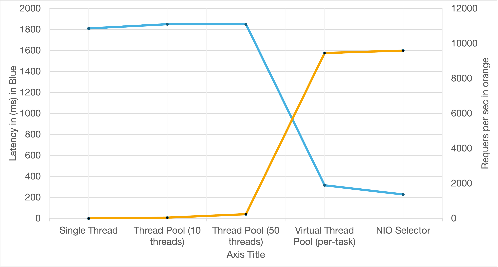

# Java Web Server Performance Benchmark

## Project Overview

This project is a performance benchmark comparing several common and modern Java server architectures. The goal is to clearly illustrate the trade-offs between blocking I/O models, thread pooling, the new **Virtual Threads** (Project Loom), and **Non-blocking I/O (NIO)** when handling concurrent client requests that involve simulated I/O latency.

All server implementations are designed to handle a basic HTTP request, simulate a **200ms downstream I/O delay** (e.g., a database query or external service call), and then send a simple "Hello, World!" response.

### Architectures Implemented

1.  **Single Thread (Blocking I/O):** One thread handles all connections sequentially. This is the baseline and demonstrates the fundamental issue of blocking I/O: the entire server is stalled by one client's delay.
2.  **Thread Pool (Blocking I/O):** A fixed pool of platform threads handles clients. While better than a single thread, it still suffers from **Thread-per-Connection** overhead and resource exhaustion when the number of concurrent connections exceeds the pool size.
3.  **Virtual Thread Pool (Blocking I/O with Virtual Threads):** Uses Java's modern Virtual Threads (via `Executors.newVirtualThreadPerTaskExecutor()`). This still uses the familiar **Thread-per-Connection** model but with extremely cheap, non-OS-blocking virtual threads, which is designed to scale with concurrent I/O-bound tasks.
4.  **NIO Selector (Non-Blocking I/O):** Uses the classic Java NIO API (`Selector`, `SocketChannel`) to handle thousands of connections with a very small number of OS threads. The I/O delay is handled via a scheduler, demonstrating the core asynchronous nature of non-blocking I/O.

---

##  Step-by-Step Implementation Details

### 1. `HttpResponse.java`

* **Purpose:** Defines the standard HTTP/1.1 response bytes array used by all servers.
* **Key Detail:** Ensures a consistent response payload across all tests.

### 2. Blocking I/O Servers (`SingleThreadServer.java`, `ThreadPoolServer.java`, `VirtualThreadPoolServer.java`)

* These all use the traditional `java.net.ServerSocket` and `java.net.Socket`.
* The critical line demonstrating blocking I/O is:
    ```java
    // Blocks the thread until the I/O operation (sleep) is complete
    Thread.sleep(200); 
    ```
* **Concurrency Model:**
    * **Single Thread:** `server.accept()` and subsequent I/O block the *only* thread.
    * **Thread Pool:** `server.accept()` runs on the main thread; client handling is submitted to a fixed `ExecutorService` (pool of platform threads).
    * **Virtual Thread Pool:** Client handling is submitted to a `newVirtualThreadPerTaskExecutor()`, where the `Thread.sleep(200)` operation **unmounts** the virtual thread from its underlying platform carrier thread, allowing the carrier thread to pick up another task, thus achieving massive concurrency.

### 3. Non-Blocking I/O Server (`NIOServer.java`)

* **Core Components:** Uses `java.nio.channels.Selector` and `java.nio.channels.SocketChannel`.
* **Event Loop:** The `selector.select()` call waits for I/O events (`OP_ACCEPT`, `OP_READ`, `OP_WRITE`).
* **Handling Delay:** Instead of a blocking `Thread.sleep(200)`, the server uses a `ScheduledExecutorService` to defer the write operation.
    * On `OP_READ`, interest is temporarily disabled (`key.interestOps(0)`).
    * After 200ms, the scheduler re-enables `OP_WRITE` interest (`key.interestOps(SelectionKey.OP_WRITE)`), which wakes up the main loop to process the response.
* **Key Insight:** A single thread can manage thousands of concurrent connections because it never blocks waiting for I/O or the simulated delay; it simply registers interest and moves on.

---

## Performance Results

The benchmark was executed with the following parameters: **2000 concurrent connections** over a **60-second duration**, with a simulated **200ms I/O latency** for every request.

### Raw Data (comparison.csv)

| name | connections | duration | requests\_per\_sec | lat\_avg | lat\_p50 | lat\_p99 ms |
| :--- | :--- | :--- | :--- | :--- | :--- | :--- |
| **Single Thread** | 2000 | 60 | 4.86 | 1.20s | 1.20s | 1810 |
| **Thread Pool (10 threads)** | 2000 | 60 | 49.06 | 1.04s | 1.03s | 1850 |
| **Thread Pool (50 threads)** | 2000 | 60 | 245.5 | 1.03s | 1.03s | 1850 |
| **Virtual Thread Pool (per-task)** | 2000 | 60 | **9455.56** | **206.80ms** | **204.19ms** | **315.64** |
| **NIO Selector** | 2000 | 60 | **9592.38** | **204.36ms** | **202.97ms** | **228.96** |

### Visual Comparison (comparison.png)



---

##  Results Analysis

### Understanding the Trade-offs

The results clearly validate the fundamental architectural constraints of I/O-bound applications:

1.  **Single Thread & Thread Pool (Blocking I/O):**
    * **Low Throughput:** The server could only handle a small fraction of the available concurrency. The max requests per second for the 50-thread pool was $\approx 245$ requests.
    * **High Latency:** Since the server must wait for a thread to become available *and* the thread is fully blocked for the 200ms delay, the average latency is approximately **5 times** the simulated delay ($\approx 1.0$s). The server's capacity limits become the bottleneck, forcing clients to queue. The 99th percentile latency is severely impacted.
    * *The Thread-per-Connection model is non-scalable when threads are blocked.*

2.  **Virtual Thread Pool & NIO Selector (High Concurrency Models):**
    * **Massive Throughput:** Both models handled a throughput increase of over **38x** compared to the 50-thread pool. Both achieved $\approx 9500$ requests/sec.
    * **Low, Stable Latency:** The average latency for both is $\approx 200$ms, which is the **minimal possible latency** because it is the simulated I/O delay. The server's I/O processing is no longer the bottleneck.
    * **Virtual Threads:** This is the easiest-to-write implementation. By adopting the Virtual Thread Pool, we keep the familiar *blocking code style* (`Thread.sleep(200)`) but achieve NIO-level performance. This is a game-changer for I/O-bound enterprise applications, as it provides high scalability without the complexity of an asynchronous, callback-based framework.
    * **NIO Selector:** While achieving the same peak throughput as Virtual Threads, the code is significantly more complex, requiring explicit I/O channel management, state attachment (`key.attach(resp)`), and an external scheduler for the simulated delay. It remains a high-performance, low-level option, but the introduction of Virtual Threads offers a compelling, higher-level alternative for most applications.

**Conclusion:** For applications dominated by I/O-bound tasks (like this simulation), the **Virtual Thread Pool** offers the superior solution, matching the performance of a complex NIO implementation while retaining the simplicity and readability of a traditional blocking thread-per-request architecture.